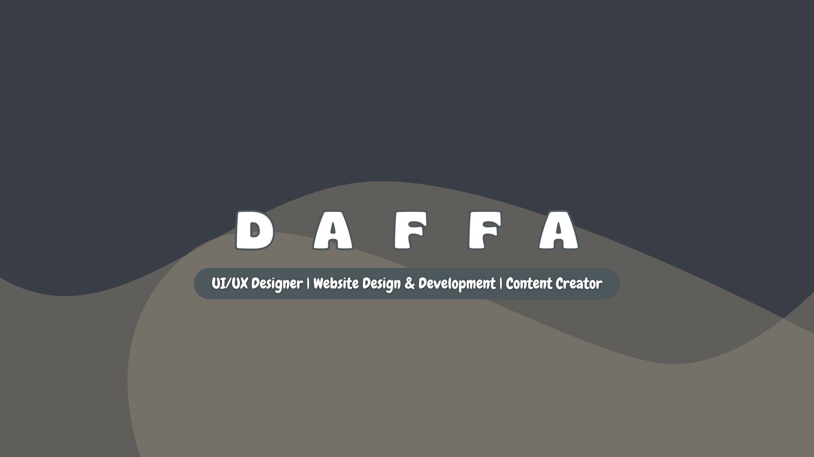

🎓 Multidisciplinary digital creator with a background in <strong>Informatics Engineering</strong> from <a href="https://unikom.ac.id">UNIKOM</a> and <strong>Broadcasting & Film</strong> from SMKN 10 Bandung. 
Passionate about combining <strong>technology</strong> and <strong>visual creativity</strong> to build meaningful, engaging digital experiences.

## 🚀 Let's Connect!

🤝 Open to freelance work, internships, and creative collaborations. Let’s build something great together!
 
  

## 💻 Web Development

🧠 I specialize in building **responsive**, **user-friendly** websites and web applications.

**🛠️ Languages & Tools:**  
 
 
 
 
 

---

## 🎨 Graphic Design

🖌️ Experienced in creating compelling visual content for print and digital.

**🧰 Tools:**  
 
 

🎨 **Projects:**  
- 🎯 Poster designs  
- 📱 Instagram feed layouts  
- 📢 Branding & promotional content

---

## 🎬 Video Editing

🎞️ Creative editor producing content for **TikTok**, **YouTube**, and **news-style feature videos**.

**🛠️ Software:**  
 
 

📽️ **Content Types:**
- 🔹 Short-form videos (Reels, TikTok)  
- 🔹 Long-form YouTube content  
- 🔹 Feature news videos  

---

## 📚 Certifications

- 🧠 **CCNA: Introduction to Networks** – Cisco Networking Academy  
- 🛠️ Completed various freelance and academic multimedia projects

# 💻 Tech Stack:
                      
# 📊 GitHub Stats:
 
 

## 🏆 GitHub Trophies

### 🔝 Top Contributed Repo

---

  

<em>“Creativity is intelligence having fun.” – Albert Einstein</em>

 
